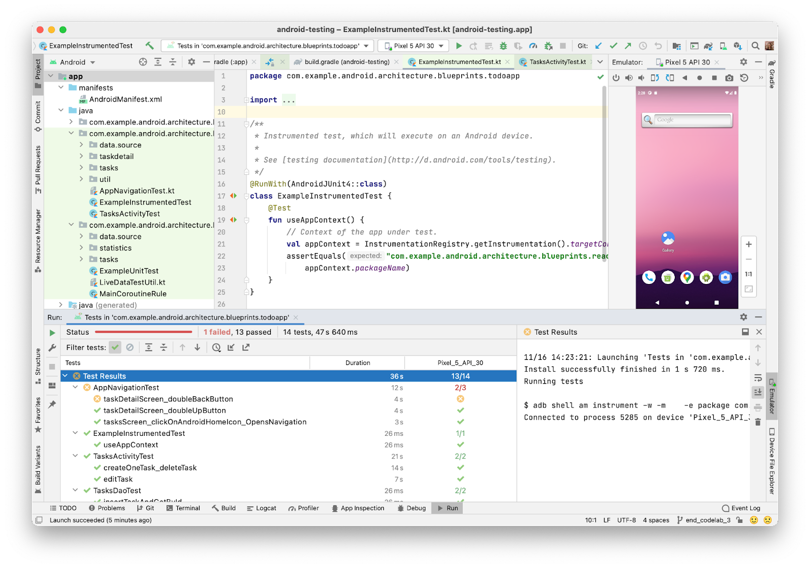
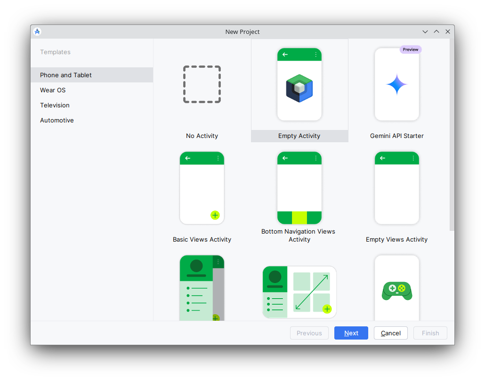

# Lab 02. Android App Development

## 2.1. Android Studio Demo

[Android Studio](https://developer.android.com/studio) is the official IDE
(Integrated Development Environment) from Google which is used to build Android
applications.

As your first task, download and install it! (_for Linux users_, it's
recommended to simply get the archive, unzip it somewhere and run in from
there!).

When prompted, download your SDKs (no need for Emulator, unless you want to
build Android apps away from your Raspberry Vanilla Tablet).

### New projects

There are two paradigms for building Android UI layouts: the old way (using XML
resources created using a WISIWYG editor, manipulated using a object-oriented
Views API in Java or Kotlin) and the new way, called
[_Jetpack Compose_](https://developer.android.com/compose) (only available when
using Kotlin).

Click on `File -> New Project`. Choose `Empty Activity` if you wish to make a
Jetpack Compose Pro or, if you wish to do it the old way:
`Empty Views Activity`.

Fire up your IDE and let's proceed to run it on our RPIs!
