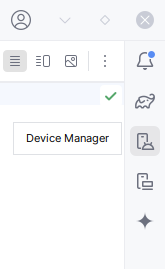
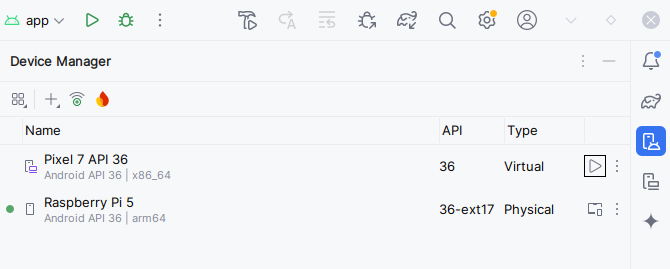
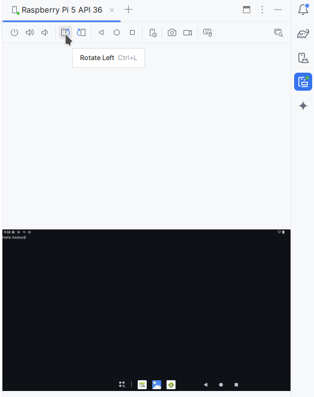

# Lab 02. Android App Development

## 2.2. Inspecting the demo

Connect your Raspberry Pi5 using USB-C to your laptop.

_Note: you can check using `adb devices` in a terminal if it was properly
detected._

### The Android Device Manager

On the right side of the screen, select Device Manager:

The Raspberry Pi device should be visible:

### Run the Demo App

Create a new empty project if you haven't already (`Summer App`, as hinted by
previous section).

Let's run it (click on the "Run" icon at the top of the screen):

Check out your tablet ;) If it's unconfortable due to small USB cable, you can
also stream its display by clicking on the “Start Mirroring” icon:

You can also rotate the display (which affects both the physical screen and its
mirror):

