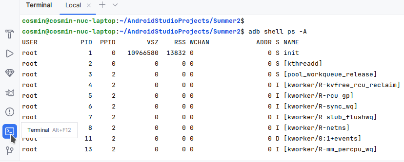
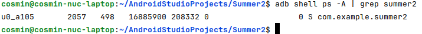

# Lab 02. Android App Development

## 2.2. Inspecting the demo

Connect your Raspberry Pi5 using USB-C to your laptop.

_Note: you can check using `adb devices` in a terminal if it was properly
detected._

### The Android Device Manager

On the right side of the screen, select Device Manager:


The Raspberry Pi device should be visible:


### Run the Demo App

Create a new empty project if you haven't already (`Summer App` and
`com.aospi.summer` package name, as hinted by previous section).

Let's run it (click on the "Run" icon at the top of the screen):


Check out your tablet ;) If it's unconfortable due to small USB cable, you can
also stream its display by clicking on the “Start Mirroring” icon:


You can also rotate the display (which affects both the physical screen and its
mirror):


### Inspecting/managing the applications using ADB

Open the Terminal from Android Studio and type:

```sh
adb shell ps -A
```



Find the PID of the current application. Since this tutorial named the
application `SummerApp`, grep for the corresponding name in the list of
processes:



But since we have root, where is this app stored? Enter a `adb shell` to find
out:

```sh
# inside `adb shell`:
# use the package manager
pm list
# to grep for our app:
pm list packages -f | grep summer
# ahaaa! it's inside a temporary /data/app/~~<tmp name> dir
ls -l /data/app/
# => meet SELinux Mandatory Access Control, even if you are root :/
```

Next, we'll develop some app with an UI and multiple screens (_ahem_, 2).
