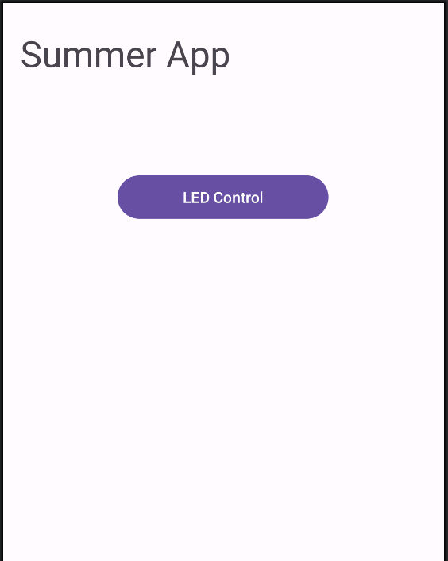
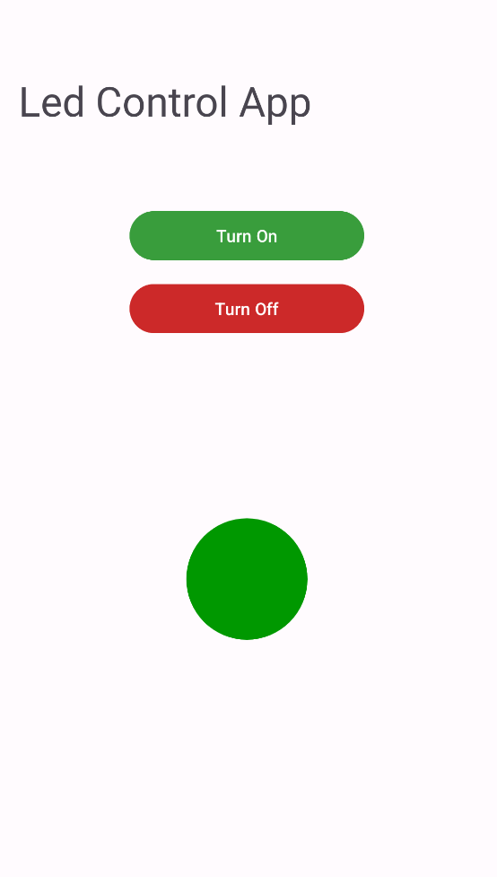

# Lab 02. Android App Development

## 2.3. Designing a somewhat-complex app

### The plan

You get tasked to build a simple IoT app for LED control.

Here's some horrible mock-up of the idea:

|              Main View               |           Led Control View            |
| :----------------------------------: | :-----------------------------------: |
|  |  |

### Initial steps

We'll be using
[Google's Official JetPack Compose codelab](https://developer.android.com/codelabs/basic-android-kotlin-compose-text-composables)
for this.

Build your first view with a welcoming message and some buttons.

Here's [some material-themed components](https://composables.com/material/button) to choose from ;)  

If you wish, please make them log different on-click debug messages with LogCat
(make sure to test it!).

Next, try to follow this
[Application Lifecycle tutorial](https://developer.android.com/codelabs/basic-android-kotlin-compose-activity-lifecycle).

### Navigation

[Here's the Google CodeLab tutorial for navigating between screens](https://developer.android.com/codelabs/basic-android-kotlin-compose-navigation)

Or, if you wish a more traditional tutorial:
https://medium.com/@elfrmkr98/how-to-navigate-between-screens-with-jetpack-compose-kotlin-ca6f6f403699

### Making the LED toggle

Finally, try to make our hypothetical LED toggle between on and off (make the
image change).

We'll be interfacing real ones tomorrow!
